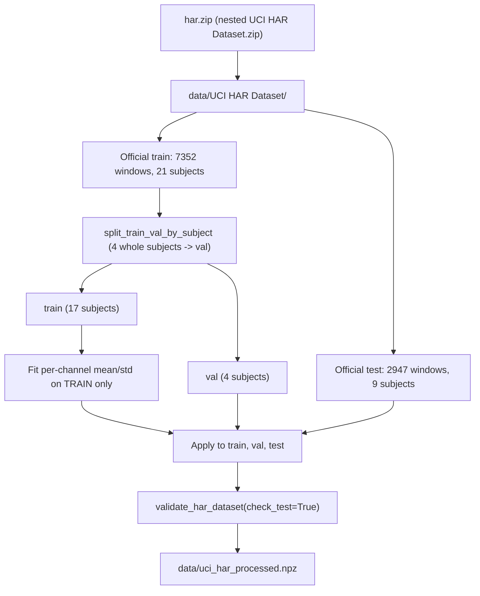
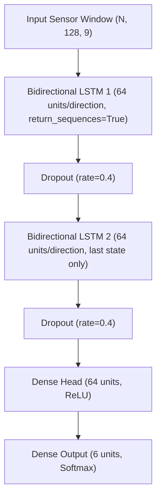

# BiLSTM Component & Shared Data Loader for Human Activity Recognition (HAR)

**Author:** Member 3  
**Component:** Component 3 - Bidirectional LSTM + Shared UCI HAR Data Loader  
**Framework:** TensorFlow / Keras (Trained from scratch)  
**Project:** SE4050 Deep Learning Assignment  

---

## 1. Executive Summary & Team Context

This component delivers two things:

1. **The shared UCI HAR loader** (`src/data/uci_har_loader.py`). It turns the raw dataset into `data/uci_har_processed.npz`, which follows the shared data contract. Every member's real training loads this file.
2. **A stacked Bidirectional LSTM classifier** (`src/models/bilstm.py`, `src/train_bilstm.py`) with the same structure, config pattern, and run outputs as the Transformer component.

### Team Architecture Comparison

| Member | Assigned Component | Key Responsibilities |
| :--- | :--- | :--- |
| **Dharana** | **Transformer Encoder** | Self-attention model, data contract, training & run artifact logging. |
| **Member 2** | **1D-CNN & EDA** | 1D Convolutional baseline, exploratory data analysis on raw inertial signals. |
| **Member 3 (Me)** | **BiLSTM & Data Pipeline** | Bidirectional LSTM model, shared data loader with subject-wise splitting. |
| **Member 4** | **CNN-LSTM & Evaluation** | Hybrid CNN-LSTM architecture, shared multi-model benchmark evaluation & metrics. |

---

## 2. Shared UCI HAR Data Loader

### Dataset
Reyes-Ortiz, J., Anguita, D., Ghio, A., Oneto, L., & Parra, X. (2013). *Human Activity Recognition Using Smartphones* [Dataset]. UCI Machine Learning Repository. https://doi.org/10.24432/C54S4K (CC BY 4.0)

* 30 subjects wearing a waist-mounted smartphone. The official split puts 21 subjects in train and 9 in test.
* Windows are 2.56 s at 50 Hz, which gives **128 readings**. Consecutive windows overlap by **50%**.
* There are **9 raw inertial channels**, stacked in this order (same as `SENSOR_CHANNEL_NAMES` in the contract):
  `body_acc_x, body_acc_y, body_acc_z, body_gyro_x, body_gyro_y, body_gyro_z, total_acc_x, total_acc_y, total_acc_z`

### Pipeline



| Function | Purpose |
| :--- | :--- |
| `download_uci_har(dest_dir, force)` | Downloads the zip, unzips it twice, and re-downloads if the existing archive is corrupt or partial. |
| `load_inertial_signals(dir, split)` | Reads the 9 signal files, each `(N, 128)`, and stacks them to `(N, 128, 9)` float32. |
| `load_engineered_features(dir, split)` | The 561 hand-crafted features `(N, 561)`. Only for a classical SVM baseline. |
| `load_labels(dir, split)` | Reads labels in 1..6 and returns them as **0..5**. |
| `load_subjects(dir, split)` | One subject ID per window. |
| `split_train_val_by_subject(subjects, labels, n_val_subjects, seed)` | Seeded pick of whole subjects for validation. It asserts that the two sides are disjoint and re-draws (seed, seed+1, ...) until all 6 classes appear on both sides. |
| `build_processed_dataset(...)` | The main entry point. It loads, splits, standardizes, and validates. |
| `save_processed_dataset(data, out_path)` | Writes `np.savez_compressed` with exactly the 9 contract keys. |

### Why the validation split is by subject
Consecutive windows overlap by 50%, so neighbouring windows share half their readings. A random split would put almost identical windows in both train and validation. Validation accuracy would then measure memorisation, not generalisation to new people. Holding out **whole subjects** makes validation behave like the test set, which contains people the model has never seen. `validate_har_dataset` raises on any subject overlap, and the loader satisfies that check. It does not work around it.

### Why standardization uses train statistics only
If val/test statistics were used, information from the held-out people would leak into preprocessing. The loader fits a per-channel mean and std on the train split only, using `apply_training_standardization` from the contract, and then applies those numbers unchanged to val and test.

### Output (seed 42, 4 validation subjects)

| Split | Windows | Subjects |
| :--- | :--- | :--- |
| train | 5952 | 1, 5, 6, 7, 8, 11, 14, 15, 17, 19, 21, 25, 26, 27, 28, 29, 30 |
| val | 1400 | 3, 16, 22, 23 |
| test | 2947 | 2, 4, 9, 10, 12, 13, 18, 20, 24 |

No subject appears in more than one split. All 6 classes appear in every split.

```bash
python -m src.data.uci_har_loader --download
# options: --data-dir --out --n-val-subjects --seed --no-standardize
```

---

## 3. BiLSTM Model Architecture



### Layer-by-Layer Tensor Dimensions

| Stage | Layer / Operation | Output Tensor Shape | Parameters |
| :--- | :--- | :--- | :--- |
| **Input** | `Input(shape=(128, 9))` | `(N, 128, 9)` | 0 |
| **BiLSTM 1** | `Bidirectional(LSTM(64, return_sequences=True))` | `(N, 128, 128)` | 2 × 4 × (64 × (9 + 64) + 64) = 37,888 |
| **Dropout** | `Dropout(0.4)` | `(N, 128, 128)` | 0 |
| **BiLSTM 2** | `Bidirectional(LSTM(64))` | `(N, 128)` | 2 × 4 × (64 × (128 + 64) + 64) = 98,816 |
| **Dropout** | `Dropout(0.4)` | `(N, 128)` | 0 |
| **Head** | `Dense(64, activation='relu')` | `(N, 64)` | 8,256 |
| **Output** | `Dense(6, activation='softmax')` | `(N, 6)` | 390 |
| | | **Total** | **145,350** |

The factor 4 counts the LSTM's gates (input, forget, cell candidate, output). The factor 2 counts the forward and backward directions. The two directions are concatenated, so each BiLSTM outputs `2 × 64 = 128` features.

### Design Rationale
* **Recurrent memory.** An activity is defined by how the motion evolves over the window, for example the rhythm of steps compared with a static posture. The LSTM's gated cell state carries information across all 128 time steps. The forget gate lets it drop what is irrelevant.
* **Bidirectional reading.** Each 2.56 s window is classified as a whole after it has been recorded, not streamed in real time. That means the future half of the window is legitimately available. Reading in both directions gives every time step context from both sides.
* **Two stacked layers.** The first layer returns its full sequence, so the second layer can model higher-level temporal patterns. The second returns only its final states, which summarise the whole window.
* **Dropout 0.4.** This is higher than the Transformer's 0.2, because the recurrent layers hold most of the parameters and overfit quickly on 17 training subjects.
* **Adam, lr 5e-4, `clipnorm=1.0`.** LSTMs are more sensitive to the learning rate than attention models. Gradient clipping prevents the occasional exploding-gradient spike from backpropagation through time.
* **Loss.** Sparse categorical crossentropy on integer labels 0..5, the same as the Transformer, so the two models are directly comparable.

---

## 4. Hyperparameters (`configs/bilstm.json`)

The config uses the same sectioned layout as `configs/transformer.json`. `load_config` merges the file onto defaults, section by section.

| Section | Key | Value |
| :--- | :--- | :--- |
| model | `lstm_units` | 64 |
| model | `n_layers` | 2 |
| model | `dropout` | 0.4 |
| model | `dense_units` | 64 |
| training | `learning_rate` | 0.0005 |
| training | `batch_size` | 64 |
| training | `epochs` | 60 (early stopping on `val_loss`, patience 10, best weights restored) |
| training | `reduce_lr_*` | factor 0.5, patience 5, min 1e-6 |
| data | `npz_path` | `data/uci_har_processed.npz` (already standardized, so `normalize: false`) |
| output | `base_dir` | `outputs/bilstm` |

---

## 5. Training Pipeline & Run Artifacts

The run outputs have the same layout as the Transformer's:

```text
outputs/bilstm/run_YYYYMMDD_HHMMSS/
├── best_model.keras       # Model with the best validation loss
├── history.json           # Epoch-by-epoch loss & accuracy metrics (JSON)
├── history.csv            # Epoch-by-epoch metrics log (CSV)
├── config.json            # Exact hyperparameter and training configuration
└── run_metadata.json      # System info, parameter count, wall-clock time, subject IDs
```

`run_metadata.json` includes `duration_seconds`, `seconds_per_epoch` and `total_parameters`, which Member 4's comparison needs. It also includes `data_source`, which records whether the run used the real NPZ or the synthetic fallback.

**The test split is never used in training.** `train_bilstm_pipeline` reads only `X_train/y_train` and `X_val/y_val`. Early stopping, checkpointing and learning-rate scheduling all monitor `val_loss`. `tests/test_bilstm.py::test_08` fills `X_test` with NaN before training and checks that the loss stays finite.

### Results (`notebooks/04_bilstm.ipynb`, seed 42, Colab T4 GPU)

The notebook compared variants on the validation split. The best was the **baseline**: 64 units, 2 layers and lr 5e-4, exactly `configs/bilstm.json` (best val loss 0.333, val acc 88.1%). It reaches **88.9% test accuracy, 0.888 macro F1 and 0.983 macro ROC-AUC** on the 9 held-out test subjects. The main error is SITTING predicted as STANDING (109 of 491 windows, 75.6% recall on SITTING). A waist-mounted sensor sees a nearly identical gravity vector in both postures.

---

## 6. Integration Instructions for Team Members

### Everyone: building and loading the shared dataset
```python
from src.data.uci_har_loader import build_processed_dataset, save_processed_dataset
from src.data_contract import load_har_npz

# One-time build (or: python -m src.data.uci_har_loader --download)
data = build_processed_dataset("data/UCI HAR Dataset", n_val_subjects=4, seed=42)
save_processed_dataset(data, "data/uci_har_processed.npz")

# Every later run
data = load_har_npz("data/uci_har_processed.npz")   # already standardized
```

### Training the BiLSTM from Python
```python
from src.train_bilstm import load_config, train_bilstm_pipeline

config = load_config("configs/bilstm.json")
model, metadata, run_dir = train_bilstm_pipeline(config)            # loads the NPZ
model, metadata, run_dir = train_bilstm_pipeline(config, data=data) # or pass a contract dict
```

### For Member 4 (Shared Evaluation Integration)
```python
import numpy as np
from src.models.bilstm import load_bilstm_model, predict_bilstm

model = load_bilstm_model("outputs/bilstm/run_xxx/best_model.keras")
y_probs = predict_bilstm(model, X_test)      # (N_test, 6)
y_pred = np.argmax(y_probs, axis=-1)          # classes 0-5
```

---

## 7. Execution & CLI Commands

```bash
# Build the shared dataset
python -m src.data.uci_har_loader --download

# All tests (Transformer + loader + BiLSTM)
python -m unittest discover -s tests -p "test_*.py"

# Synthetic smoke test (2 epochs)
python src/train_bilstm.py --smoke-test

# Full training (overrides: --epochs --batch-size --lr --seed --output-dir)
python src/train_bilstm.py --config configs/bilstm.json --data-path data/uci_har_processed.npz
```
