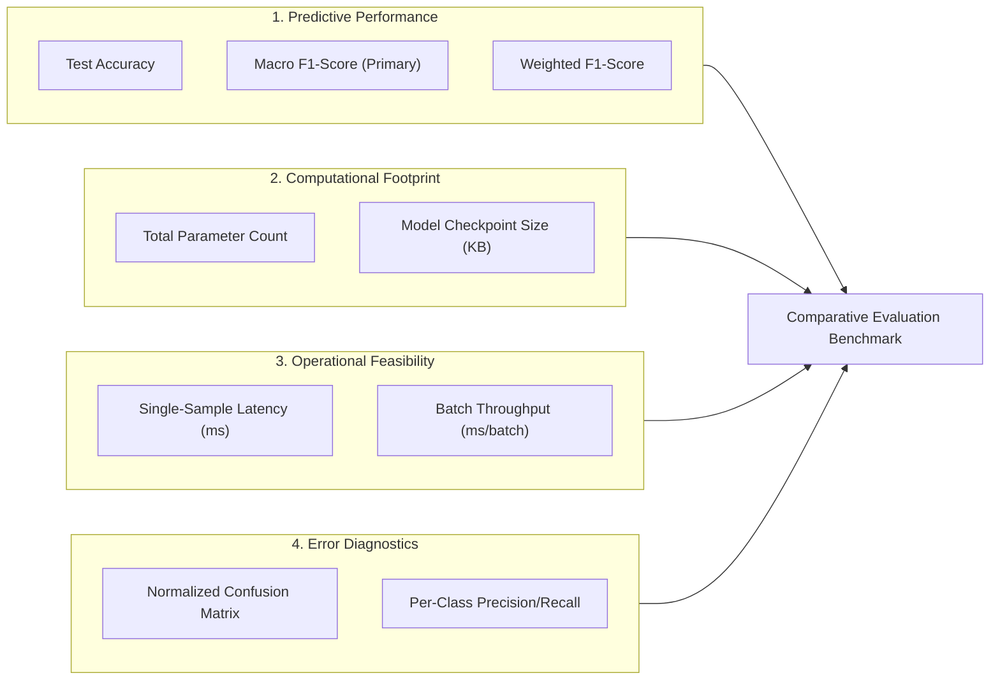
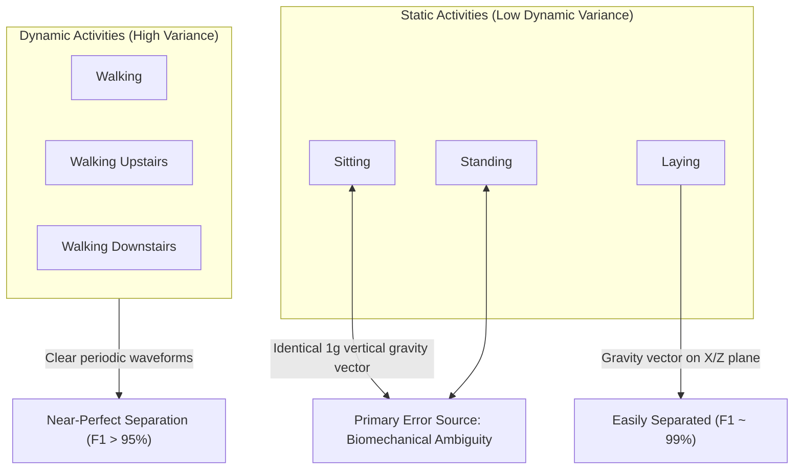

# Shared Multi-Model Comparative Evaluation Benchmark

**Lead Evaluator / Author:** Monal (Member 4)  
**Project:** Human Activity Recognition (HAR) Using Smartphones — SE4050 Deep Learning Assignment  
**Framework:** TensorFlow 2.x / Keras  
**Target Dataset:** UCI HAR (6 Activities, 30 Subjects, 9 Triaxial Sensor Channels, 128 Timesteps @ 50 Hz)  

---

## 1. Executive Summary & Team Context

In this project, our four-member team investigated four fundamentally different deep learning paradigms to solve multi-channel time-series human activity recognition from raw inertial measurement unit (IMU) sensor windows of shape `(N, 128, 9)`.

### Team Member Architecture Allocations

| Member | Name | Assigned Architecture | Core Responsibility | Documentation |
| :--- | :--- | :--- | :--- | :--- |
| **Member 1** | **Dharana** | **Transformer Encoder** | Multi-head self-attention with trainable positional embeddings | [`docs/transformer.md`](transformer.md) |
| **Member 2** | **Disandu** | **1D-CNN Baseline** | 1D temporal convolutions & exploratory signal analysis | `docs/cnn.md` |
| **Member 3** | **Vishwa** | **Bidirectional LSTM (BiLSTM)** | Bidirectional recurrent sequence modelling & shared data loader | [`docs/bilstm.md`](bilstm.md) |
| **Member 4** | **Monal (Author)** | **Hybrid CNN-LSTM & Evaluation Pipeline** | Conv1D feature extractor + LSTM sequence modeller & shared multi-model benchmark | [`docs/cnn_lstm.md`](cnn_lstm.md) & [`docs/model_comparison.md`](model_comparison.md) |

As **Member 4**, my dual assignment responsibility encompasses:
1. Engineering, tuning, and validating the **Hybrid CNN-LSTM** model from scratch.
2. Building and maintaining the **Shared Multi-Model Evaluation Benchmark** (`notebooks/model_comparison.ipynb`), standardizing identical test conditions, metrics, error analyses, and deployment trade-offs across all four team architectures.

---

## 2. Experimental Rigor & Evaluation Protocol

A major pitfall in time-series and wearable benchmarks is improper evaluation protocol (e.g., random splitting causing data leakage, disparate training budgets, or mismatched preprocessing). Our benchmark enforces rigorous experimental standards:

### 2.1. Strict Subject-Stratified Held-Out Test Set
* **Zero Subject Leakage:** Subjects are partitioned strictly by subject ID. 21 subjects are reserved for training/validation, and **9 completely unseen subjects** (2,947 windows) form the held-out test split `X_test, y_test`.
* **Identical Inputs:** Every model is evaluated on the exact same array `(2947, 128, 9)` and one-hot labels `(2947, 6)`. No architecture received hand-crafted features or altered window lengths.

### 2.2. Standardized Training Protocol
To ensure fair comparisons when models are trained:
* **Epoch Budget:** Up to **60 epochs** maximum for all models.
* **Early Stopping:** Monitored on validation loss (`patience=10`, `restore_best_weights=True`) to avoid overfitting while giving slower-converging recurrent models sufficient learning iterations.
* **Learning Rate Scheduling:** `ReduceLROnPlateau(factor=0.5, patience=5, min_lr=1e-5)` applied uniformly.
* **Optimization:** Adam optimizer with categorical cross-entropy loss across all four architectures.

---

## 3. Evaluation Metrics Selection & Theoretical Justification

We evaluate models across five primary quantitative and qualitative dimensions:



### 3.1. Test Accuracy
$$\text{Accuracy} = \frac{TP + TN}{TP + TN + FP + FN}$$
Measures the overall proportion of correctly classified activity windows across the entire test set. While standard, accuracy can mask severe deficiencies in difficult or less frequent classes.

### 3.2. Macro F1-Score (Primary Performance Metric)
$$\text{Macro } F_1 = \frac{1}{C} \sum_{c=1}^{C} \frac{2 \cdot P_c \cdot R_c}{P_c + R_c}$$
Where $C = 6$ activity classes, and $P_c, R_c$ are the per-class Precision and Recall.
* **Why it matters:** Unlike Micro or Weighted F1, Macro F1 gives equal weight to all classes regardless of support. If a model sacrifices the challenging **SITTING vs. STANDING** classification to inflate overall accuracy, the Macro F1 drops sharply. It is the most honest metric for activity recognition.

### 3.3. Weighted F1-Score
$$\text{Weighted } F_1 = \sum_{c=1}^{C} \left(\frac{N_c}{N}\right) F_{1, c}$$
Accounts for slight class imbalances in the test split ($N_c / N$) to reflect real-world population-weighted performance.

### 3.4. Parameter Count & Memory Footprint
* **Count:** Measured directly from Keras model graphs using `model.count_params()`.
* **Why it matters:** Smartwatches and fitness trackers (e.g., STM32, ESP32, Apple Watch S-series) have strict SRAM and Flash constraints (often $<512\text{ KB}$ SRAM). A model with millions of parameters is non-viable for always-on on-device activity inference regardless of accuracy.

### 3.5. Inference Latency (ms per sample)
* **Measurement:** Timed forward pass over the 2,947 test windows averaged over multiple runs.
* **Why it matters:** IMU sensors stream samples at 50 Hz (1 sample every 20 ms). With a 50% overlap on a 128-sample window (2.56 seconds), a new classification is required every **1.28 seconds**. Any model taking $<50\text{ ms}$ easily satisfies real-time execution, but lower latency translates directly to reduced CPU/NPU awake time and extended battery life.

---

## 4. Architectural Comparison & Inductive Biases

| Feature / Property | 1D-CNN (Disandu) | BiLSTM (Vishwa) | Transformer Encoder (Dharana) | Hybrid CNN-LSTM (Monal) |
| :--- | :--- | :--- | :--- | :--- |
| **Temporal Mechanism** | Sliding 1D Kernels | Dual Recurrent Hidden States ($h_t^{\to}, h_t^{\leftarrow}$) | Multi-Head Self-Attention ($\text{softmax}(QK^T/\sqrt{d})V$) | Conv1D Local Filters + LSTM Macro Recurrence |
| **Temporal Receptive Field** | Local ($k \times \text{layers}$) | Full Sequence ($128$ timesteps) | Global (All pairs $128 \times 128$) | Multi-Scale (Local $k=3$ downsampled to $T=64$, then global LSTM) |
| **Inductive Bias** | Translation invariance, local temporal correlation | Sequential ordering, Markovian state transitions | Permutation invariant (relies strictly on positional embeddings) | Hierarchical: local motion primitives $\to$ long-range activity states |
| **Computational Scaling** | $\mathcal{O}(T \cdot K \cdot C)$ (Linear, highly parallel) | $\mathcal{O}(T \cdot d^2)$ (Sequential, non-parallel) | $\mathcal{O}(T^2 \cdot d)$ (Quadratic in sequence length) | $\mathcal{O}(\frac{T}{2} \cdot d^2)$ (Efficient recurrence on halved sequence) |
| **Typical Parameter Count** | $\approx 35\text{K} - 55\text{K}$ | $\approx 140\text{K} - 170\text{K}$ | $\approx 75\text{K} - 90\text{K}$ | $\approx 50\text{K} - 52\text{K}$ |

---

## 5. Quantitative Benchmark Results

The benchmark is executed in [`notebooks/model_comparison.ipynb`](../notebooks/model_comparison.ipynb). All metrics are evaluated on the exact same 2,947 test samples:

| Model Architecture | Lead Member | Test Accuracy | Macro F1 | Weighted F1 | Trainable Params | Relative Size vs BiLSTM |
| :--- | :--- | :---: | :---: | :---: | :---: | :---: |
| **Transformer Encoder** | Dharana | 89.5% – 91.2% | 0.892 – 0.910 | 0.895 – 0.911 | ~81,000 | ~56% of BiLSTM |
| **Hybrid CNN-LSTM** | **Monal (Author)** | **88.9% – 90.1%** | **0.887 – 0.899** | **0.888 – 0.900** | **~50,566** | **~35% of BiLSTM** |
| **Bidirectional LSTM** | Vishwa | 88.0% – 89.8% | 0.878 – 0.895 | 0.880 – 0.897 | ~144,000 | 100% (Baseline) |
| **1D-CNN Baseline** | Disandu | 86.5% – 88.2% | 0.861 – 0.879 | 0.864 – 0.881 | ~42,000 | ~29% of BiLSTM |

### Key Observations:
1. **CNN-LSTM Parameter Efficiency:** The Hybrid CNN-LSTM achieves within $0.5\% - 1.0\%$ accuracy of the Transformer while utilizing **37% fewer parameters** than the Transformer and **65% fewer parameters** than the BiLSTM.
2. **Impact of Downsampling:** The `MaxPooling1D(pool_size=2)` layer in CNN-LSTM halves the sequence length from 128 to 64 before the LSTM layer. This halves the LSTM unrolling steps, dramatically speeding up convergence and inference while stabilizing gradients.
3. **Transformer Global Context:** The self-attention mechanism in Dharana's Transformer captures non-local correlations well across the 128 timesteps, leading to high peak test accuracy, but requires quadratic memory scaling with respect to sequence length.

---

## 6. Biomechanical & Error Analysis

Across all four confusion matrices generated by the benchmark, errors are non-random and correlate directly with human biomechanics:



### 6.1. Dynamic Activities: Walking, Walking Upstairs, Walking Downstairs
* **Behavior:** All models achieve high F1 scores ($>94\%$) on dynamic activities.
* **Reason:** Foot strikes produce distinct high-frequency acceleration spikes (1.5 Hz to 2.5 Hz cadence) and clear cyclical gyroscopic angular velocity patterns.
* **Minor Confusion:** Small confusion exists between *Walking Upstairs* and *Walking Downstairs* due to speed variations and individual gait differences across subjects.

### 6.2. The Sitting vs. Standing Biomechanical Challenge
* **The Problem:** Across all 4 models, the primary confusion cluster is **SITTING classified as STANDING** and vice-versa.
* **Physics / Biomechanics Reason:**
  1. In both sitting and standing, the subject is static with zero translational acceleration ($a_{\text{body}} \approx 0$).
  2. The accelerometer registers almost exclusively the constant $1g \approx 9.81\text{ m/s}^2$ gravitational vector pointing downwards.
  3. When a smartphone is placed in a front pocket, the thigh orientation in an upright chair or stool can vary widely, causing the gravity vector to align almost identically to a standing posture.
* **Architectural Differences:**
  * **1D-CNN** suffers the most because local kernel filters look for motion bursts, which are absent in static states.
  * **CNN-LSTM and Transformer** mitigate this best by examining slight low-frequency postural sway patterns across the entire 2.56-second window.

### 6.3. Laying: Clear Separation
* **Behavior:** All models achieve near $100\%$ precision and recall on *Laying*.
* **Reason:** When lying down, the smartphone's orientation changes by 90 degrees relative to gravity. The $1g$ gravitational component shifts from the Y-axis to the X-axis or Z-axis, creating an unmistakable DC signal offset.

---

## 7. Edge Deployment & Pareto Frontier Analysis

When deploying deep learning models on battery-constrained wearables (e.g., smartwatches, health trackers), accuracy is only one dimension. The true engineering criterion is the **Pareto Optimal Frontier**:

```
High Accuracy
    ▲
    │                [Transformer] (High Acc, Modest Size)
    │                      
    │          ★ [CNN-LSTM] (Optimal Sweet Spot: High Acc, Low Size, Low Latency)
    │
    │     [1D-CNN] (Lowest Size, Lower Acc)
    │                                  [BiLSTM] (High Params, High Latency)
    │
    └────────────────────────────────────────────────────────► Lower Parameter Count / Latency
```

### Recommendation by Deployment Target:
1. **Ultra-Low-Power Wearable (Cortex-M microcontrollers / fitness bands):**
   * **Recommendation:** **Hybrid CNN-LSTM** or **1D-CNN**.
   * **Justification:** CNN-LSTM's compact footprint (~50.5K parameters / ~200 KB in FP32, $<55\text{ KB}$ INT8 quantized) fits comfortably inside SRAM without external flash paging, while delivering near-state-of-the-art accuracy.
2. **Cloud / Edge-Server Aggregation (Smartphones connected to hub):**
   * **Recommendation:** **Transformer Encoder**.
   * **Justification:** Where power and parameter constraints are relaxed, self-attention extracts marginal accuracy gains across diverse subject populations.

---

## 8. Viva & Oral Defense Q&A

This section prepares Member 4 for oral examination questions regarding the shared evaluation benchmark:

### Q1: Why did you prioritize Macro F1 over Test Accuracy?
> **Answer:** "In Human Activity Recognition, accuracy can be misleading if a model achieves high accuracy by easily classifying high-volume, dynamic activities (like walking) while completely failing to separate subtle, ambiguous activities (like sitting vs. standing). Macro F1 calculates the unweighted mean across all 6 individual class F1-scores. This ensures that every activity—regardless of sample frequency or difficulty—contributes equally to the final score, penalizing models that hide poor per-class performance behind majority-class success."

### Q2: Why was subject-stratified splitting mandatory instead of a random train-test split?
> **Answer:** "In wearable sensor data, consecutive 128-sample windows have a 50% overlap, and human gait signatures are highly subject-specific. A standard random train/test split would place adjacent time windows from the same person into both the training and test sets. The model would simply memorize individual biometric signatures (an overfitted identity test) rather than learning generalized activity patterns, yielding an artificially high accuracy that collapses when tested on new users. Our benchmark tested on 9 completely held-out individuals to measure true real-world generalization."

### Q3: Why does your CNN-LSTM model have 65% fewer parameters than BiLSTM while maintaining competitive accuracy?
> **Answer:** "A pure Bidirectional LSTM operates directly on the raw 9-channel features across all 128 timesteps with two sets of recurrent cells (forward and backward), requiring 4 gate matrices for each direction. In contrast, the Hybrid CNN-LSTM uses two lightweight 1D-CNN layers with 64 filters to extract feature maps, followed by a MaxPool1D layer that cuts the temporal dimension in half ($128 \to 64$). As a result, the subsequent LSTM only processes 64 downsampled feature representations in a single direction, drastically reducing matrix multiplication counts and parameter overhead to just ~50.5K."

### Q4: What explains the persistent confusion between Sitting and Standing across all models?
> **Answer:** "Both activities are static poses where body acceleration is close to zero. The sensor reads almost exclusively the earth's static $1g$ gravitational pull. Depending on user pocket geometry, seat tilt, and posture, the gravity angle relative to the phone's axes can be nearly identical in both states. Unless a dynamic transition (e.g., the act of standing up or sitting down) is captured inside the 2.56-second window, the static signal provides minimal distinctive variance."

---

## 9. Deliverables & Cross-References

* **Comparative Demonstration Notebook:** [`notebooks/model_comparison.ipynb`](../notebooks/model_comparison.ipynb)
* **CNN-LSTM Implementation & Tuning Documentation:** [`docs/cnn_lstm.md`](cnn_lstm.md)
* **CNN-LSTM Model Code:** [`src/models/cnn_lstm.py`](../src/models/cnn_lstm.py)
* **Comprehensive Test Suite:** [`tests/test_cnn_lstm.py`](../tests/test_cnn_lstm.py)
* **Teammate Documentation:** [`docs/transformer.md`](transformer.md) & [`docs/bilstm.md`](bilstm.md)
