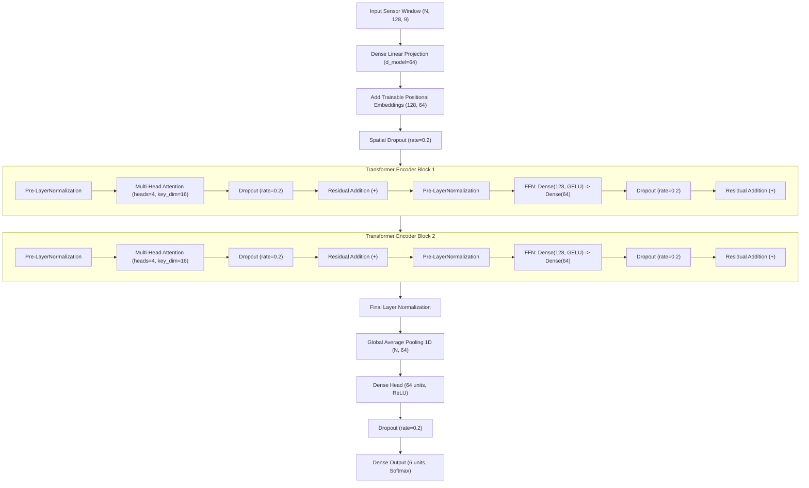

# Transformer Encoder Component for Human Activity Recognition (HAR)

**Author:** Dharana  
**Component:** Component 1 - Transformer Encoder  
**Framework:** TensorFlow / Keras (Trained from scratch)  
**Project:** SE4050 Deep Learning Assignment  

---

## 1. Executive Summary & Team Context

This component implements a pure **Transformer Encoder** architecture for multi-channel sensor time-series classification on the UCI Human Activity Recognition (HAR) Using Smartphones dataset.

### Team Architecture Comparison

| Member | Assigned Component | Key Responsibilities |
| :--- | :--- | :--- |
| **Dharana (Me)** | **Transformer Encoder** | Model architecture, trainable positional embeddings, serialization, self-contained training & run artifact logging. |
| **Member 2** | **1D-CNN & EDA** | 1D Convolutional baseline, exploratory data analysis on raw inertial signals. |
| **Member 3** | **BiLSTM & Data Pipeline** | Bidirectional LSTM model, shared data loader with subject-wise stratification. |
| **Member 4** | **CNN-LSTM & Evaluation** | Hybrid CNN-LSTM architecture, shared multi-model benchmark evaluation & metrics. |

---

## 2. Model Architecture & Mathematical Formulation

The architecture is specifically engineered to model long-range temporal dependencies across 9 triaxial inertial sensor channels without recurrence.



### Layer-by-Layer Tensor Dimensions

| Stage | Layer / Operation | Output Tensor Shape | Description |
| :--- | :--- | :--- | :--- |
| **Input** | `Input(shape=(128, 9))` | `(N, 128, 9)` | 128 temporal timesteps (2.56s window @ 50Hz) $\times$ 9 sensor channels. |
| **Projection** | `Dense(64)` | `(N, 128, 64)` | Linear projection to latent model dimension $d_{\text{model}}=64$. |
| **Position** | `TrainablePositionalEmbedding` | `(N, 128, 64)` | Adds learnable 1D temporal position matrix $P \in \mathbb{R}^{128 \times 64}$. |
| **Encoder 1** | `TransformerEncoderBlock` | `(N, 128, 64)` | Pre-LN MHA ($4 \times 16$) + GELU FFN ($128 \to 64$) with residual additions. |
| **Encoder 2** | `TransformerEncoderBlock` | `(N, 128, 64)` | Second Pre-LN encoder block. |
| **Norm** | `LayerNormalization` | `(N, 128, 64)` | Post-encoder LayerNorm. |
| **Pooling** | `GlobalAveragePooling1D` | `(N, 64)` | Temporal pooling: $\bar{x} = \frac{1}{T} \sum_{t=1}^{T} x_t$. |
| **Head** | `Dense(64, activation='relu')` | `(N, 64)` | Classification feature representation. |
| **Output** | `Dense(6, activation='softmax')` | `(N, 6)` | Normalized probability distribution over 6 activity classes. |

---

## 3. Custom Layer Serialization

To ensure that `.keras` models can be saved and loaded across all environments without deserialization issues, all custom layers are registered with `@register_keras_serializable(package="har_transformer")`:

* `TrainablePositionalEmbedding`: Stores `seq_len` and `d_model` in `get_config()`, instantiating via `from_config()`.
* `TransformerEncoderBlock`: Stores `d_model`, `num_heads`, `key_dim`, `d_ff`, `ffn_activation`, and `dropout_rate`.

### Loading a Saved Model
```python
from src.models.transformer import load_transformer_model

model = load_transformer_model("outputs/transformer/run_xxx/best_model.keras")
predictions = model.predict(X_test)
```

---

## 4. Shared Data Contract & Leakage Prevention

The data pipeline enforces the four-member team data contract:

### Contract Specifications
1. **Window Dimensions:** `X_train`, `X_val`, and `X_test` must be float32 arrays of shape `(N, 128, 9)`.
2. **Activity Labels:** `y_train`, `y_val`, and `y_test` must be 1D integer arrays with values in $\{0, 1, 2, 3, 4, 5\}$.
   * `0`: WALKING
   * `1`: WALKING_UPSTAIRS
   * `2`: WALKING_DOWNSTAIRS
   * `3`: SITTING
   * `4`: STANDING
   * `5`: LAYING
3. **Subject Stratification:** `subject_train` and `subject_val` contain subject IDs per window.
4. **Subject Leakage Constraint:** $\text{Subjects}(\text{Train}) \cap \text{Subjects}(\text{Val}) = \emptyset$.
5. **Class Representation:** Both train and validation splits must contain all 6 activities.
6. **Normalization Isolation:** Channel mean $\mu_c$ and standard deviation $\sigma_c$ must be calculated **exclusively on the training split** and applied to validation/test:
   $$\hat{X}^{(c)} = \frac{X^{(c)} - \mu_{\text{train}}^{(c)}}{\sigma_{\text{train}}^{(c)}}$$
   *Never compute statistics on validation or test sets.*
7. **Test Set Isolation:** The test split is held out solely for final benchmark evaluation by Member 4. It is never used for hyperparameter tuning, model selection, or early stopping.

---

## 5. Training Pipeline & Run Artifacts

Each training execution writes a self-contained artifact directory:

```text
outputs/transformer/run_YYYYMMDD_HHMMSS/
├── best_model.keras       # Full serialized Keras model with best validation loss
├── history.json           # Epoch-by-epoch loss & accuracy metrics (JSON)
├── history.csv            # Epoch-by-epoch metrics log (CSV)
├── config.json            # Exact hyperparameter and training configuration
└── run_metadata.json      # System info, parameter count, duration, subject IDs
```

### Metadata JSON Schema
```json
{
  "author": "Dharana",
  "component": "Transformer Encoder Classifier",
  "timestamp_start": "2026-09-23T12:00:00.000000",
  "timestamp_end": "2026-09-23T12:02:15.000000",
  "duration_seconds": 135.2,
  "epochs_trained": 42,
  "total_parameters": 68550,
  "trainable_parameters": 68550,
  "non_trainable_parameters": 0,
  "best_val_loss": 0.1842,
  "best_val_loss_epoch": 32,
  "final_val_accuracy": 0.9412,
  "seed": 42,
  "train_subjects": [1, 3, 5, 6, 7, 8, 11, 14, 15, 16, 17, 19, 21, 22, 23, 25, 26, 27, 28, 29, 30],
  "val_subjects": [2, 4, 9, 10, 12, 13],
  "num_train_samples": 5881,
  "num_val_samples": 1471,
  "system_info": { ... }
}
```

---

## 6. Integration Instructions for Team Members

### For Member 3 (Data Loader Integration)
Export the preprocessed dataset as an NPZ archive or pass a data dictionary directly to `train_transformer_pipeline()`:
```python
from src.train_transformer import train_transformer_pipeline, load_config

# Using dictionary from Member 3's shared loader:
dataset = {
    "X_train": X_train,          # (N_train, 128, 9)
    "y_train": y_train,          # (N_train,)
    "subject_train": sub_train,  # (N_train,)
    "X_val": X_val,              # (N_val, 128, 9)
    "y_val": y_val,              # (N_val,)
    "subject_val": sub_val,      # (N_val,)
}
config = load_config("configs/transformer.json")
model, metadata, run_dir = train_transformer_pipeline(config, data=dataset)
```

### For Member 4 (Shared Evaluation Integration)
Load the saved model and evaluate on the test split:
```python
from src.models.transformer import load_transformer_model, predict_transformer

# 1. Load trained model
model = load_transformer_model("outputs/transformer/run_xxx/best_model.keras")

# 2. Get activity probability matrix (N_test, 6)
y_probs = predict_transformer(model, X_test)

# 3. Obtain discrete class predictions (0-5)
y_pred = np.argmax(y_probs, axis=-1)
```

---

## 7. Execution & CLI Commands

### 1. Run Unit & Contract Tests
```bash
python -m unittest discover -s tests -p "test_*.py"
```

### 2. Run Synthetic Smoke Test
```bash
python src/train_transformer.py --smoke-test
```

### 3. Run Full Training (with preprocessed NPZ dataset)
```bash
python src/train_transformer.py --config configs/transformer.json --data-path data/uci_har_processed.npz
```
